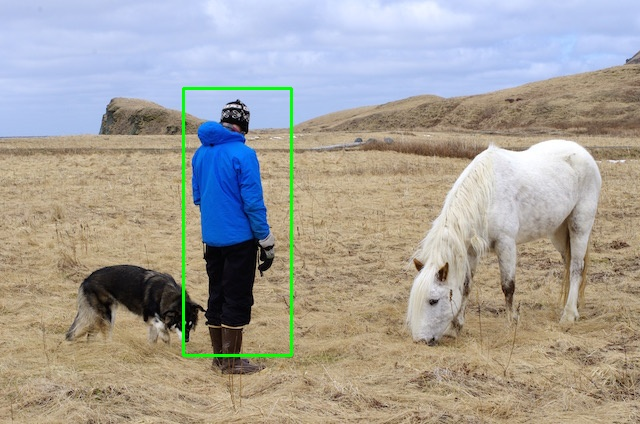
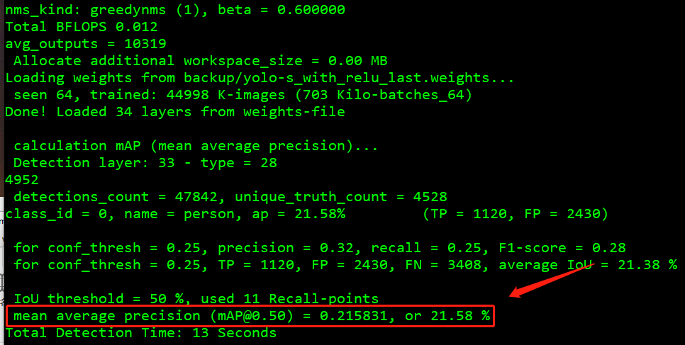

<center><h1>Person detection</h1></center>

> 让 AI 在你的板子上尽情舞蹈~
>
> 本次实验的是识别摄像头中的人，就一个人，而不是多个。
>
> 从多类别检测模型改编而来，只保留 person 这个类别，根据各位看官的能力完全可以改成识别多类

本次项目的篇幅将会较长，请各位看官耐心看完

整体分为三部分：

1. [模型](#1-模型)
2. [RT-AK 使用](#2-RT-AK 使用)
3. [板子上的应用层代码实现](#3-应用代码)

硬件平台 ART-Pi, 50M FLOPS。

**我的模型（删减后的模型）**最终部署在板子上是**推理时间**是56ms，不包括数据处理时间。

- pc 端推理一张图片：

```shell
$ pip install -r requirements.txt
$ python inference_yolo-s.py
```



- 以下是在 ART-PI 上的模型推理实现：


# 1 模型

## 1.1 参考项目

> 参考项目：[Yolo-Fastest](https://github.com/dog-qiuqiu/Yolo-Fastest) & [[keras-YOLOv3-model-set](https://github.com/david8862/keras-YOLOv3-model-set)](https://github.com/david8862/keras-YOLOv3-model-set)

原因：目前了解的全网最轻量级的目标检测网络，没有之一

> 现在不是了，出现了一个 ppyolo，百度产

| Network                     | Model Size | mAP(VOC 2017) | FLOPS      |
| --------------------------- | ---------- | ------------- | ---------- |
| Tiny YOLOv2                 | 60.5MB     | 57.1%         | 6.97BFlops |
| Tiny YOLOv3                 | 33.4MB     | 58.4%         | 5.52BFlops |
| YOLO Nano                   | 4.0MB      | 69.1%         | 4.51Bflops |
| MobileNetv2-SSD-Lite        | 13.8MB     | 68.6%         | &Bflops    |
| MobileNetV2-YOLOv3          | 11.52MB    | 70.20%        | 2.02Bflos  |
| Pelee-SSD                   | 21.68MB    | 70.09%        | 2.40Bflos  |
| ***Yolo Fastest***          | 1.3MB      | 61.02%        | 0.23Bflops |
| ***Yolo Fastest-XL***       | 3.5MB      | 69.43%        | 0.70Bflops |
| ***MobileNetv2-Yolo-Lite*** | 8.0MB      | 73.26%        | 1.80Bflops |

当然，Yolo Fastest 最小的模型也有 0.23 Bflops，想要在 ART-Pi 上顺利的跑起来，肉眼可见的丝滑程度，我是在做梦。。。

这时候有两个办法：

1. 换一块板子，换一块算力更大的板子。
2. 将模型改的小一点，能够在 ART-PI 上丝滑的跑起来。

这里我选择的是后者。

我改动的很简单，去掉特征金字塔输出，只保留一个输出，保证对大物体检测友好即可。同时删减网络结构。原来是109层，我是20+层网络结构。

纠正一个思想误区，由于一些很神奇的存在，网络并不是越深，`FLOPS` 就会越大，比如 `DSCNN`。

---

第二个参考项目的意义是在于：将模型转变为 `tflite` 可食用模型

## 1.2 模型文件

- 我改动的模型配置文件：`./model/yolo-s_with_lrelu.cfg` 

  > 原模型配置文件：`./model/VOC`
  >
  > 为了防止在后期模型转换的过程中遇到不支持的算子：`leakyrelu`，我这里提供了一份 `relu` 的模型训练配置文件

- 预先训练好的模型：`./model/yolo-s.h5` 507 k，量化的 `tflite` 模型文件：`./model/yolo-s.tflite` 144 k

## 1.3 自己训练模型

请参考： [Yolo-Fastest](https://github.com/dog-qiuqiu/Yolo-Fastest) 项目 

我自己也写过一份[快速上手 yolo-fastest 教程](https://blog.csdn.net/weixin_37598106/article/details/112544854?spm=1001.2014.3001.5501)， 但是由于 up 主更新的比较快，可能有一些版本落后，仅供参考。

1. 需要配置 `darknet` 训练环境，然后根据需求修改下  `cfg` 文件即可

2. 准备数据集：`VOC 2007 + VOC 2012`

    ```shell
    wget https://pjreddie.com/media/files/VOCtrainval_11-May-2012.tar
    wget https://pjreddie.com/media/files/VOCtrainval_06-Nov-2007.tar
    wget https://pjreddie.com/media/files/VOCtest_06-Nov-2007.tar
    tar xf VOCtrainval_11-May-2012.tar
    tar xf VOCtrainval_06-Nov-2007.tar
    tar xf VOCtest_06-Nov-2007.tar

    wget https://pjreddie.com/media/files/voc_label.py
    # 修改文件，将里面的类别只保留 person 类别
    python voc_label.py

    cat 2007_train.txt 2007_val.txt 2012_*.txt > train.txt
    ```

​	修改 `./model/voc_person.data` 中的 `train` 和 `valid` 路径，注意，如果你不是训练 `person`  单类别，请一并修改 `voc_person.names` 文件

3. 训练

    ```shell
    $ ./darknet detector train <data_path> <cfg_path> 

    # 举例， -dont_show 是不显示图片， -gpus 是指定 gpu 训练
    $ ./darknet detector train voc_person.data yolo-s.cfg -dont_show -gpus 0, 1
    ```

4. 测试

    > `perons.jpg` 位于 `./imgs`

    ```shell
    # test 1 image
    ./darknet detector test voc_person.data yolo-s.cfg yolo-s_last.weights person.jpg -thresh 0.5 -dont_show

    # mAP
    ./darknet detector map voc_person.data yolo-s.cfg yolo-s_last.weights -points 11
    ```

    

    模型转换成 `keras`，最后转成 `tflite`

    > 对应的代码仓库：[Lebhoryi/keras-YOLOv3-model-set](https://github.com/Lebhoryi/keras-YOLOv3-model-set)，
    >
    > 转自 [david8862/keras-YOLOv3-model-set](https://github.com/david8862/keras-YOLOv3-model-set) ，我做了一些修改，请按照我的来，否则出错请自负😂😂😂

    ```shell
    # yolo-fastest to keras
    python tools/model_converter/convert.py cfg/yolo-s.cfg weights/yolo-s_last.weights weights/yolo-s.h5  -f -c

    # keras to tflite
    python tools/model_converter/custom_tflite_convert.py --keras_model_file ./weights/yolo-s.h5 --output_file ./weights/yolo-s.tflite

    # keras to tflite; quantize
    python tools/model_converter/post_train_quant_convert.py --keras_model_file ./weights/yolo-s.h5 --annotation_file /home/lebhoryi/Data/VOC/2007_test.txt --model_input_shape 160x160 --sample_num 30 --output_file ./weights/yolo-s.tflite -c
    ```

  # 2 RT-AK 使用

具体使用请查阅 [RT-Thread/RT-AK](https://github.com/RT-Thread/RT-AK) 相关文档

准备：

- ART-PI bsp
- 模型
- RT-AK

使用：

  ```shell
$ git clone https://github.com/RT-Thread/RT-AK

$ cd RT-AK/RT-AK/rt_ai_tools

# 只需要改动 --model、--project、--ext_tools 三个参数的路径即可
$ python aitools.py --model=./yolo-s.h5 --model_name=person_yolo --project=D:\RT-ThreadStudio\workspace\art-pi --platform stm32 --ext_tools="D:\Program Files (x86)\stm32ai-windows-5.2.0\windows" --clear
  ```

 # 3 应用代码

> 我的输入是 160x160x1，为了减小模型参数大小，

先在 pc 端实现应用层的代码

- [x] 图片预处理：尺度缩放+灰度转化+归一化
- [x] yolo 解码
- [x] nms 处理

代码都在 `inference_yolo-s.py` 中。

手边没有 `usb` 摄像头，也就没有写视频的推理代码，只有图片的推理代码。

功能实现：

1. 图片预处理

   `python` 里头就很简单，调用 `opencv` 库，几行代码搞定

   ```python
   img_raw = cv2.imread(str(img_path))
   img = cv2.cvtColor(img_raw, cv2.COLOR_BGR2GRAY)
   img = cv2.resize(img, (160, 160), interpolation=cv2.INTER_LINEAR)
   img = img / 255.0
   img = np.asarray(img).astype('float32')
   ```

2. yolo 解码

   `inference_yolo-s.py` 中的 `yolo_decode` 函数

   模型推理的是检测目标的 `xywh` 的偏移量，目的是将模型输出结果转换成真实世界的 `xywh`

   这部分呢，我也写了一篇文章，感兴趣的可以看一下：[掌握 yolo - 解码核心思想，](https://blog.csdn.net/weixin_37598106/article/details/113058426?spm=1001.2014.3001.5501)

3. nms

   `inference_yolo-s.py` 中的 `non_max_suppress` 函数，这个函数针对的是单类别的

---

c 代码的实现比较痛苦，，痛苦面具 x3

- [x] 灰度转换
- [x] 尺度缩放
- [x] yolo 解码
- [ ] nms （可能五一节后实现）

1. 灰度转换

   RGB转灰度，通常会使用下面的一个心理学公式：(Matlab和OpenCV中使用的也是该公式)

   ```shell
   Gray = 0.2989*R + 0.5870*G + 0.1140*B
   # 优化
   Gray = （2989*R + 5870*G + 1140*B）/ 10000
   # 移位
   Gray = （4898*R + 9618*G + 1868*B）>> 14
   # 8位精度
   Gray = （76*R + 150*G + 30*B）>> 8
   ```

   ```c
   // c 代码实现
   void rgb2gray(unsigned char *src,unsigned char *dst, int width,int height)
   {
       int r, g, b;
       for (int i=0; i<width*height; ++i)
       {
           r = *src++; // load red
           g = *src++; // load green
           b = *src++; // load blue
           // build weighted average:
           *dst++ = (r * 76 + g * 150 + b * 30) >> 8;
       }
   }
   ```

   ```python
   # python 代码实现
   # val_c_gray_scaling.py
   def img2gray(img_path):
       # 读取第一张图像
       img = cv2.imread(img_path)
       # 获取图像尺寸
       h, w = img.shape[0:2]
       # 自定义空白单通道图像，用于存放灰度图
       gray = np.zeros((h, w), dtype=img.dtype)
       # 对原图像进行遍历，然后分别对B\G\R按比例灰度化
       for i in range(h):
           for j in range(w):
               gray[i, j] = 0.11 * img[i, j, 0] + 0.59 * img[i, j, 1] + 0.3 * img[i, j, 2]  # Y=0.3R+0.59G+0.11B
       show_img(gray)
       return gray
   ```

2. 尺度缩放

   此处用的是双线性插值

   ```c
   int is_in_array(short x, short y, short height, short width)
   {
       if (x >= 0 && x < width && y >= 0 && y < height)
           return 1;
       else
           return 0;
   }
   
   void bilinera_interpolation(rt_uint8_t* in_array, short height, short width, 
                               rt_uint8_t* out_array, short out_height, short out_width)
   {
       double h_times = (double)out_height / (double)height,
              w_times = (double)out_width / (double)width;
       short  x1, y1, x2, y2, f11, f12, f21, f22;
       double x, y;
   
       for (int i = 0; i < out_height; i++){
           for (int j = 0; j < out_width; j++){
               x = j / w_times;
               y = i / h_times;
             
               x1 = (short)(x - 1);
               x2 = (short)(x + 1);
               y1 = (short)(y + 1);
               y2 = (short)(y - 1);
               f11 = is_in_array(x1, y1, height, width) ? in_array[y1*width+x1] : 0;
               f12 = is_in_array(x1, y2, height, width) ? in_array[y2*width+x1] : 0;
               f21 = is_in_array(x2, y1, height, width) ? in_array[y1*width+x2] : 0;
               f22 = is_in_array(x2, y2, height, width) ? in_array[y2*width+x2] : 0;
               out_array[i*out_width+j] = (rt_uint8_t)(((f11 * (x2 - x) * (y2 - y)) +
                                          (f21 * (x - x1) * (y2 - y)) +
                                          (f12 * (x2 - x) * (y - y1)) +
                                          (f22 * (x - x1) * (y - y1))) / ((x2 - x1) * (y2 - y1)));
           }
       }
   }
   ```

   `python` 代码实现：`val_c_gray_scaling.py` 中的 `bilinera_interpolation` 函数

3. yolo 解码

   ```c
   // c 代码实现
   // applications/yolo.c
   int yolo_decode(float *out_data)
   {
     int j=0,k=0,l=0;
     for(int i=0; i<5*5*5; i++)
     {
       float x_tmp = 1 / (1 + exp(-out_data[i*6+0]));
       float y_tmp = 1 / (1 + exp(-out_data[i*6+1]));
       float box_x = (x_tmp + k) / 5;
       float box_y = (y_tmp + l) / 5;
       
       float box_w = (exp(out_data[i*6+2])*anchor[j][0])/ input_dims[0];
       float box_h = (exp(out_data[i*6+3])*anchor[j][1])/ input_dims[1];
       
       float objectness = 1 / (1 + exp(-out_data[i*6+4]));
       
       float class_scores = 1 / (1 + exp(-out_data[i*6+5]));
      
   //    printf("%d %d %d %f %f, %f %f, %f %f\n", j,k,l, box_x, box_y, box_w, box_h, objectness, class_scores);
       
       out_data[i*6+0] = box_x;
       out_data[i*6+1] = box_y;
       out_data[i*6+2] = box_w;
       out_data[i*6+3] = box_h;
       out_data[i*6+4] = objectness;
       out_data[i*6+5] = class_scores;
       
       if(j++>=4)
       {
         j = 0;
         if(k++>=4)
         {
           k = 0;
           if(l++>=4)
           {
             l = 0;
           }
         }
       }
     }
     return 0;
   }
   ```

   python 代码实现：`inference_yolo-s.py` 中的 `yolo_decode` 函数

4. nms 

   没有 `nms` 的目标检测工程就等于没有灵魂，，，等后期来实现

---

编译报错以及解决


第二种解决方式：


# 4. 参考链接

- [C++ RGB转灰度图像](https://blog.csdn.net/martinkeith/article/details/104185635)

- [GBeetle/c_image_processing/scaling/scaling.c](https://github.com/GBeetle/c_image_processing/blob/4ceabf4959f455f5b7d1ee419aac25eccf231b3b/scaling/scaling.c#L155)

